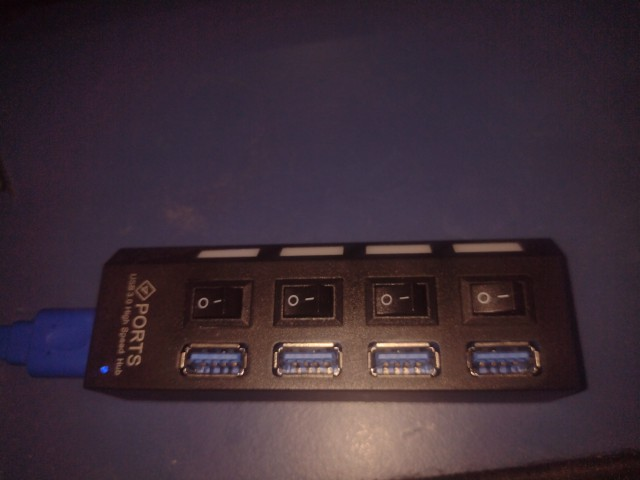

.. _troubleshooting:

Troubleshooting
###############

I installed openFPGALoader but it says `command not found` when I try to launch it
==================================================================================

The correct spelling of the program is *openFPGALoader* with FPGA and the "L" of "Loader" in uppercase.
Ensure the spelling of the program is correct.

Gowin device could not communicate since last bitstream flashed. (issue `#206 <https://github.com/trabucayre/openFPGALoader/issues/206>`_)
==========================================================================================================================================

Gowin's FPGA may fails to be detected if **JTAGSEL_N** (pin 08 for *GW1N-4K*) is used as a GPIO.
To recover you have to pull down this pin (before power up) to recover JTAG interface (*UG292 - JTAGSELL_N section*).

JTAG init failed
================

Avoid using USB hubs like these:

and connect it directly to your PC USB port.

Tang Primer 20k program slow and stucked (issue `#250 <https://github.com/trabucayre/openFPGALoader/issues/250>`_)
==================================================================================================================

Check your openFPGALoader version:

.. code:: bash

    openFPGALoader -V

If it is older than release then v0.9.0, install the most recent version (from commit `f5b89bff68a5e2147404a895c075773884077438 <https://github.com/trabucayre/openFPGALoader/commit/fe259fb78d185b3113661d04cd7efa9ae0232425>`_ or later).

Cannot flash Tang Nano 9k (issue `#251 <https://github.com/trabucayre/openFPGALoader/issues/251>`_)
===================================================================================================

This is a device issue, erase its Embedded Flash using Official GoWin Programmer (preferentially in Windows) and SRAM too, then you can use openFPGALoader again.

Unable to open FTDI device: -4 (usb_open() failed) (issue `#245 <https://github.com/trabucayre/openFPGALoader/issues/245>`_)
============================================================================================================================

Edit your `/etc/udev/rules.d/99-ftdi.rules` file exchanging your programming device permissions.

To identify what is your USB programming device, with your programmer UNPLUGGED run:

.. code:: bash

    watch lsusb

You will see your USB devices connected to your computer, then plug in your programmer. You will notice there is a new device on the list.

Let's suppose you found:

.. code:: text

    Bus 002 Device 004: ID 0403:6010 Future Technology Devices International, Ltd FT2232C/D/H Dual UART/FIFO IC
                           \__/ \__/ \________________________________________________________________________/
                            |     |                     |
                            |     |                     \-----> Device Description Name
                            |     \---------------------------> idProduct
                            \---------------------------------> idVendor

in this case, you will have to add/edit your udev rule file to:

.. code:: bash

    ATTRS{idVendor}=="0403", ATTRS{idProduct}=="6010", MODE="0666"